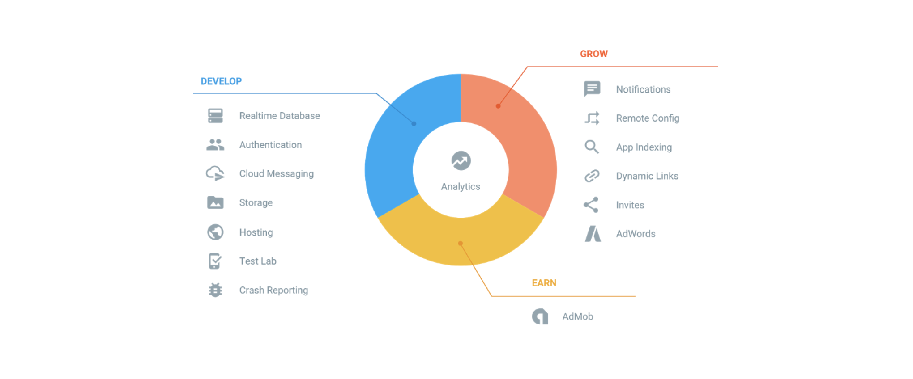
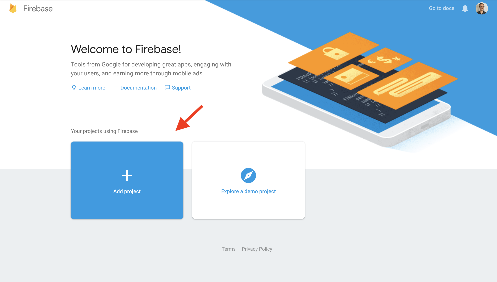
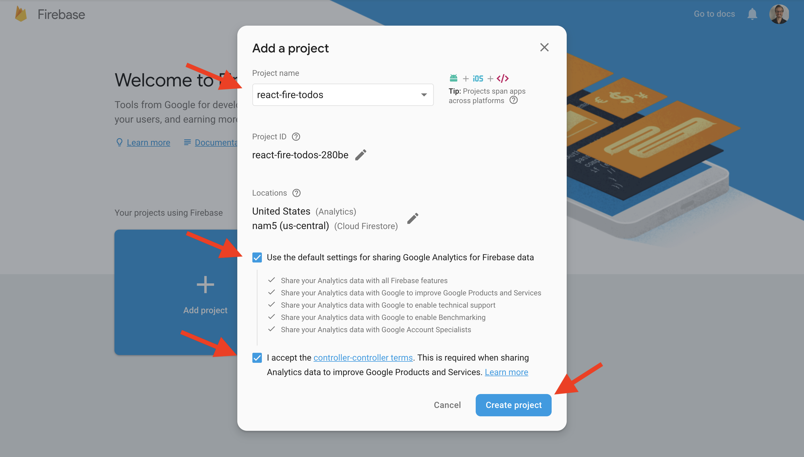
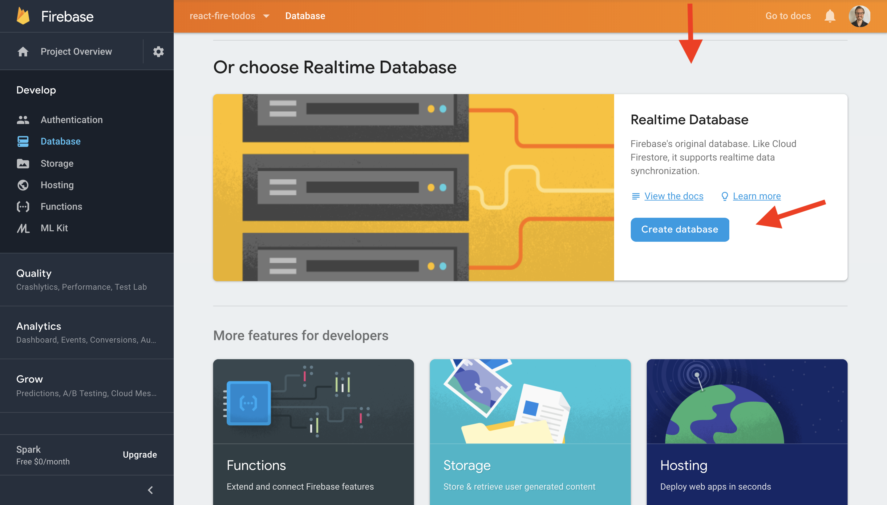
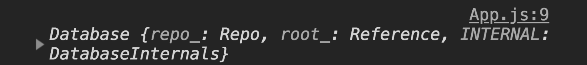

#  The FRN Stack


For this lesson, we'll look at a secretly popular tech stack known at the FRN stack (Firebase, ReactJS, and NodeJS). 

Here are the high level points we'll cover in this lesson:

- Pre-requisites and requirements
- What is Google Firebase?
- Set up Google Firebase
- Light overview of React/Setup for lesson
- Build a Todos App
- Conclusion


Here are the learning objectives:

_By the end of this lesson, students should be able to:_

- Setup a Google Firebase Project
- Use the Google Firebase Real Time Database (RTDB) and Authentication
- Reference Google Firebase documentation
- Demonstrate preliminary understanding of Google Firebase and how to use it with React

<hr>

## Pre-requisites and Requirements


_To have success in this lesson, students should have:_

- Familiarity with ReactJS Fundamentals..i.e. `components`, `props`, `component state`, `stateless functional components vs class based components`, and `component lifecycle methods`.
- latest version `nodejs` installed
- `create-react-app` build tool installed
- `VS Code`as their text editor!
- A Chrome Browser

_Please see below for links to the resources referenced above_

<hr>

## What is Google Firebase?

_Founded by James Tamplin and Andrew Lee as “Firebase” in 2011, then acquired by Google in 2014._

_“Firebase frees developers, so they can focus on creating phenomenal user experiences. You don’t need to manage servers, write an API, or configure a datastore.”_

_“Firebase is your server, your API and your datastore."_

### Who Uses Google Firebase?


Ever since Google acquired Firebase in 2014, it's rise in popularity has skyrocked to where it is today. Google Firebase gets better each year with robust features for both web and mobile applications.

Many developers and companies have found tremendous value in this technology, which is why you probably recognize most of these brands!

### Not Just A Database

This is where many people get confused when they hear of Google Firebase for the first time. Although the Real Time Database is a core feature, it's just one of several services you can use from Google Firebase:



**The Best Definition of Google Firebase is that it's a "BAAS" (Backend As A Service)**


### The Google Firebase Real Time Database (RTDB)
- The Core Service That Put the Spotlight on Firebase
- A Single JSON Object that allows up to 32 levels of Depth (We don't recommend nesting your data that deep though)

<hr>

## Setup Google Firebase

It's the moment we've all been waiting for! It's time to set up Google Firebase!

**The First Step to Get Started is to "Signup For Google Firebase"**

- Go to: [https://firebase.google.com/](https://firebase.google.com/)

### Step 1 - "Sign In":


### Step 2 - "Go to Console" or :"Get Started":


### Step 3 - "Add Project":


### Step 4 - "Project Details - Name Your Project: React-Fire-Todos":


### Step 5 - "Create Project and Continue":


### Step 6 - "Begin Setup of RTDB"


### Step 7 - "Setup RTDB Continued"


### Step 8 - "Setup RTDB Continued"


### Step 9 - "How to Add Firebase to React"


### Step 10 - "How to Add Firebase to React (continued)"


### Step 11 - "How to Add Firebase to React (continued)"


<hr>

## Setup Our React Frontend


It's time to make sparks fly! Assuming you have the `create-react-app` build tool installed. Navigate to your Desktop `cd ~/Desktop` and then run `create-react-app react-fire-todos` to build our react application and install base dependencies.

Once our app finished building, we'll need to clean it up and add some files to prepare it for Firebase Integration.

<hr>

### Step 1 - Remove `logo.svg` and JSX from `App.js`

- First we'll remove `logo.svg` inside of `./src/`
- Then remove unnecessary JSX code from `App.js`
  
Your `App.js` should look like this once you're done:

```js
import React, { Component } from 'react'
import 'App.css'

class App extends Component {
    render(){
        return(
            <div className="App">
            
            </div>
        )
    }
}

export default App
```
**NOTE: We've left the root div/JSX element in place**

<hr>

### Step 2 - Create config directory/file for Google Firebase

- Inside of `./src/` create a directory named `firebaseConfig`
- Then inside of `./src/firebaseConfig/`, create a file named `index.js`

You're directory/file structure should look like this once you're done:


<hr>

### Step 3 - Enter Google Firebase

Now we're ready to install Google Firebase! From the root of your project, go ahead and run the command `npm i firebase` (the `i` is short for install :wink:)

Then, while that's installing, add the following code to `./src/firebaseConfig/index.js`

```js
import firebase from 'firebase/app'
import 'firebase/database'
import 'firebase/auth'


const config = {
    apiKey: YOUR_API_KEY,
    authDomain: YOUR_AUTH_DOMAIN,
    databaseURL: YOUR_DATABASE_URL,
    projectId: YOUR_PROJECT_ID,
    storageBucket: YOUR_STORAGE_BUCKET,
    messagingSenderId: YOUR_MESSAGE_SENDER_ID
};

firebase.initializeApp(config)

export default firebase
```
**Please NOTE:** For the simplicity of this lesson, we'll add the literal values for each respective key in our config object...i.e. `apiKey`, `authDomain`...etc

:warning: **DO NOT PUSH TO GITHUB!** :warning:

Doing so will run the risk of your project's config access stolen by bad actors


<hr>

### Step 4 - Create your components files

Now it's time to begin creating components for our project!

The architecture of this project will be fairly straightforward. 
We'll have one parent component, which will be our "smart component", this component will be in charge of passing data/methods down to our stateless functional components.

Let's get started by creating a directory inside of `./src` named `components`. Inside of `./src/components/` create two files:

- `Dashboard.js`
- `Login.js`

Once you're done, your directory/file structure should look like this:


<hr>

### Step 5 - Add boilerplate code to component files

For your `Dashboard.js` component file, we'll make a stateless functional component. Go ahead and add this code:

```js
import React from 'react'

const Dashboard = props => (
    <div>
        <h5>Here are your Todos</h5>
        <div>
            {
                /* We'll print our todos here */
            }
            <form>
                <input />
                <button>Add Todo</button>
            </form>
        </div>
    </div>
)

export default Dashboard
```

For the `Login.js` component file, we'll make a stateless functional component for it as well. Go ahead and add the following code to that file:

```js
import React from 'react'

const Login = props => (
    <button>Login with Google</button>
)

export default Login
```

Next, for our parent component, `App.js`, we'll add the following code:

```js
import React, { Component } from 'react'
import Dashboard from './components/Dashboard'
import 'App.css'


class App extends Component {
    render(){
        return(
            <div className="App">
                <h1>Welcome to React Fire Todos</h1>
                <Dashboard />
            </div>
        )
    }
}

export default App
```

:tada: Awesome! Now we're ready to begin working with Firebase!

<hr>

## Firebase 101

For this part, we'll spend a few minutes getting familiar with the basic CRUD (**CREATE READ UPDATE DELETE**) operations of the Google Firebase RTDB (Real Time Database)

<hr>

### Setup Parent Component

1. Import `firebase` inside of `App.js`
2. Setup the `componentDidMount()` lifecycle method
3. `console.log(firebase.database())` from inside of the `componentDidMount()` lifecycle method

Once you're done, your code inside of `App.js` should look like this:

```js
import React, { Component } from 'react'
import Dashboard from './components/Dashboard'
import firebase from './firebaseConfig'
import 'App.css'


class App extends Component {
    
    componentDidMount(){
        console.log(firebase.database())
    }

    render(){
        return(
            <div className="App">
                <h1>Welcome to React Fire Todos</h1>
                <Dashboard />
            </div>
        )
    }
}

export default App
```

If we haven't done so already, it would be a good idea to run our react frontend using it's included dev server. We can do that with the following command from the root directory of our project:

`npm start`

Now, once our component mounts, we should see our Database object logged to the console:



**NOTE: We'll use the `componentDidMount()` method a lot in this section** :wink:

<hr>

### Create Data

Let's see how creating data with the Firebase RTDB works.


#### Let's create a single document.

Here's the code:

```js
// First let's save a piece of data to a variable we can reference later
const todo = { text: "Clean my room" }

firebase.database().ref('todos')
.set(todo)
.then(() => console.log("Todo Written Successfully"))
.catch(error => {
    console.log("Something Went Wrong: ", error.message)
})

```
This is what's happening:

1. First we expose our database object by calling [`.database()`](https://firebase.google.com/docs/reference/js/firebase.database) on `firebase`
2. Then we have access to a method called [`.ref()`](https://firebase.google.com/docs/reference/js/firebase.database.Reference#ref), which allows us to reference a key inside our RTDB; it will be created if it doesn't exist 
   - Think of it as a reference to a collection inside a document-based database
3. Now that we've referenced the location where our data belongs, we can pass our data to another method called [`.set()`](https://firebase.google.com/docs/reference/js/firebase.database.Reference?authuser=0#set), this method writes data to the the referenced database location, and will also overwrite any data at this location and all child locations
4. According to the [firebase documentation](https://firebase.google.com/docs/reference/js/firebase.database.Reference?authuser=0#set), [`.set()`](https://firebase.google.com/docs/reference/js/firebase.database.Reference?authuser=0#set) returns a promise, so we can handle either case of it's outcome with [JavaScript's `.then()` or `.catch()`](https://developer.mozilla.org/en-US/docs/Web/JavaScript/Guide/Using_promises)
5. In this case we can `console.log()` a message


#### What if we needed to create multiple "documents" in a collection?

_The Firebase RTDB has a special way of doing that_

Here's the code:

```js
    
const todoText = "Clean my room"

firebase.database().ref('todos')
.push({text: todoText})
.then(() => console.log("Todo Written Successfully"))
.catch(error => {
    console.log("Something went wrong: ", error.messge)
})

```

This is what's happening:

1. Now that we've referenced the location where our data belongs with `.ref('todos')`, we can pass our data to another method called [`.push()`](https://firebase.google.com/docs/reference/js/firebase.database.Reference#push), this allows us to add a child key to our `todos` key with a unique identifier as it's name and our data as it's value
   - Subsequent calls to `.push()` with data passed in will continue to add child keys to our `todos` key
2. According to the [firebase documentation](https://firebase.google.com/docs/reference/js/firebase.database.Reference#push), [`.push()`](https://firebase.google.com/docs/reference/js/firebase.database.Reference#push) returns a promise, so we can handle either case of it's outcome with [JavaScript's `.then()` or `.catch()`](https://developer.mozilla.org/en-US/docs/Web/JavaScript/Guide/Using_promises)
3. In this case we can `console.log()` a message

<hr>

### Read Data 

Let's see how reading data with the Firebase RTDB works.

Here's the code:


#### We can read a single piece of data by it's unique key once

```js
firebase.database().ref('todos/-Lb0H9NA_e32dvLg86OC')
.once('value')
.then(snapshot => console.log(snapshot.val()))
.catch(error => {
    console.log('Something Went Wrong', error.message)
})
```
This is what's happening:

1. First we reference the data by it's unique key using a string path: `todos/-Lb0H9NA_e32dvLg86OC`
2. Then we call firebase's [`.once()`](https://firebase.google.com/docs/reference/js/firebase.database.Reference?authuser=0#once) method, which listens for the specified event type we pass in once; in this case we specify `value`
   - You can check out more event types [here](https://firebase.google.com/docs/reference/js/firebase.database?authuser=0#eventtype) 
3. `.once()` returns a `Promise`, which we can handle with JavaScript's `.then()` or `.catch()`
4. Upon a success, the callback we pass as an argument to `.then()` get's passed a current snapshot of our data, which by convention, Google Firebase calls [`dataSnapshot`](https://firebase.google.com/docs/reference/js/firebase.database.DataSnapshot?authuser=0) or `snapshot`
5. We can then access the unique key or properties of that `snapshot`, with `.key` or by calling `.val()` respectively
6. Upon a failure, the callback we pass as an argument to `.catch()` get's passed an error object with a message property we can access to gather information regarding the failure


#### We can create an array containing multiple pieces of data 

**NOTE:** _This is the primary way to read data from the RTDB._

```js
firebase.database().ref('todos')
.on('value')
.then(snapshot => {
    const dataArray = []
    snapshot.forEach(childSnapshot => {
        dataArray.push({
            id: childSnapshot.key,
            ...childSnapshot.val()
        })
    })
    console.log(dataArray)
    // We could also set our state array here 
})
.catch(error => {
    console.log('Something Went Wrong', error.message)
})

```

This is what's happening:

1. First we reference our todos collection using Firebase's [`.ref()`](https://firebase.google.com/docs/reference/js/firebase.database.Reference?authuser=0#ref)
2. Then we call Firebase's [`.on()`](https://firebase.google.com/docs/reference/js/firebase.database.Reference?authuser=0#on) listener method that will listen for a particular event type at our reference; in this case, we listen for a [`value`](https://firebase.google.com/docs/reference/js/firebase.database?authuser=0#eventtype) type
   - Unlike the `.once()` method, `.on()` initializes an ongoing subscription to Firebase that always listens for the event type we specify; *"we call it and forget it"*
3. Just like `once()`, `.on()` returns a `Promise` we can handle with JavaScript's `.then()` or `.catch()` for success and failure repectively
4. For the `value` event type, we'll get the initial [`snapShot`](https://firebase.google.com/docs/reference/js/firebase.database.DataSnapshot?authuser=0) stored at whatever we pass to `.ref()`, and then trigger again each time the data changes. That `snapshot` gets passed to the annonymous callback function we pass into `.then()`
5. We then use Firebase's [`.forEach()`](https://firebase.google.com/docs/reference/js/firebase.database.DataSnapshot?authuser=0#foreach), to enumerate the `top-level` children from our `snapshot` thus providing access to each `childSnapshot` in our `snapshot`
6. `.forEach()` takes a callback as an argument so we can perform an action on each `childSnapshot`; in this case, we're creating a new object for each `childSnapshot` and pushing it into an array
7. With all of this in place, we can update state with a new array each time a change pertaining to the event we specify is detected. (i.e. ... "value", "child_added", "child_changed" ...etc)

<hr>

### Update Data

Let's see how updating data with the Firebase RTDB works.

Here's the code:

```js
// Here's the todo text we'd like to update an existing todo to
const updatedTodoText = "Clean the living room"

firebase.database().ref('todos/-Lb0H9NA_e32dvLg86OC')
.update({ text: updatedTodoText })
.then(() => console.log("Todo Updated Successfully"))
.catch(error => {
    console.log("Something went wrong: ", error.message)
})

```

This is what's happening:

1. First we reference a single piece of data we'd like to update
2. Then we call Firebase's [`.update()`](https://firebase.google.com/docs/reference/js/firebase.database.Reference?authuser=0#update) passing in the key along with it's updated value; Firebase handles the rest! :sunglasses:
3. `.update()` is an extremely powerful Firebase method, so it's recommended to [check out the documentation](https://firebase.google.com/docs/reference/js/firebase.database.Reference?authuser=0#update) to fully grasp it's capabilities
4. Just like many of the **CRUD** operations methods for the Firebase RTDB, `.update()` returns a promise we can pass to either `.then()` or `.catch()` depending on success or failure

<hr>

### Delete Data

Let's see how deleting data with the Firebase RTDB works.

Here's the code:

```js
firebase.database().ref('todos/-Lb0H9NA_e32dvLg86OC')
.remove()
.then(() => console.log('Todo Removed Successfully'))
.catch(error => {
    console.log('Something Went Wrong: ', error.message)
})
```

Here's what's happening:

1. First we reference a single piece of data we'd like to remove
2. Then we call Firebase's [`.remove()`](https://firebase.google.com/docs/reference/js/firebase.database.Reference#remove) method, which will "remove" the data at the referenced RTDB location
3. Then we can handle the `Promise` that gets returned from calling `remove()` just as before using JavaScript's `.then()` and `.catch()`

<hr>

## Let's Build an App!

One of the best ways to learn a new skill/technology is by incorporating them into a project!

That said, let's build a simple todo app using React and Firebase!

"Todo" this, we'll work in steps, let's get started:

<hr>

### Step 1 - Setup Parent Component State:

For simplicity, we'll use `App.js` that gets generated from `create-react-app` as our parent component, let's go there now.

Here's the code:

```js
// Inside of App.js

class App extends Component {
    
    state = {
        text: "",
        todos: [],
        user: null,
        isAuthenticated: false
    }
    
    render(){
        ...
 
```
1. We'll use the property initializer syntax for cleanliness
2. We need a `text` state property to store input data from our form
3. Then we'll store a collection of todo objects inside of a `todos` array property
4. Later on we'll explore how firebase handles authentication, so we'll setup a properties to store data based on authentication state.

<hr>

### Step 2 - Create a Method to Update Component State

To handle form data from `Dashboard.js` as React intended, we’ll Create a `handleChange()` method inside of `App.js` to update it’s state `text` property based on user input.

For more context on how React handles forms, you can check out [this section from the documentation](https://reactjs.org/docs/forms.html)

Here's the code:

```js
// Inside of App.js
    
class App extends Component {
    
    state = {
        text: "",
        todos: [],
        user: null,
        isAuthenticated: false
    }

    handleChange = e => {
        this.setState({ text: e.target.value })
    }
    
    render(){
        ...
 
```

<hr>

### Step 3 - Pass Methods and State as Props

To use `handleChange()` and `text` state property in the appropriate place, we’ll pass them as props to our `<Dashboard />` component.

Here's the code:

```js
// Inside of App.js

render() {
  return (
    <div className="App">
      <h1>Welcome to React Fire Todos</h1>
          <Dashboard
            text={this.state.text}
            handleChange={this.handleChange} 
          />
    </div>
  );
}
```

<hr>

### Step 4 - Wire Up Input Element in `<Dashboard />` Component

From inside of `Dashboard.js`, we can reference our `text` and `handleChange` members from `props` using `value` and `onChange`.

Here's the code:

```js
// Inside of Dashboard.js

import React from 'react'

const Dashboard = props => (
    <div>
        <h5>Here are your todos</h5>
        <div>
            {
                /* We'll Print Our Todos here*/
            }
        </div>
        <form>
            <input 
            value={props.text} 
            onChange={props.handleChange}
            />
            <button>Add Todo</button>
        </form>
    </div>
)

export default Dashboard
```

<hr>

### Step 5 - Create a Submit Handler Method in `App.js`

Now let’s create a submit handler method for our form element.

Here's the code:

```js
// Inside of App.js

handleSubmit = e => {
  e.preventDefault()
  firebase.database().ref('todos')
  .push({ text: this.state.text })
  .then(() => {
    this.setState({ text: "" })
    console.log("Data Created Successfully")
  })
  .catch(error => {
      console.log("Something Went Wrong: ", error)
   })
}
```

<hr>

### Step 6 - Pass Submit Handler as Prop to `<Dashboard />` Component

In `App.js`, Just as we’ve done with state and our change handler, we’ll pass our submit handler as a prop to our `Dashboard` component.

Here's the code:

```js
// Inside of App.js

render() {
  return (
    <div className="App">
      <h1>Welcome to React Fire Todos</h1>
          <Dashboard
            text={this.state.text}
            handleChange={this.handleChange}
            handleSubmit={this.handleSubmit} 
          />
    </div>
  );
}
```

<hr>

### Step 7 - Final Setup of Form Element

Now we can reference the `handleSubmit` event handler in our form using `onSubmit`

Here's the code:

```js
// Inside of Dashboard.js

import React from 'react'

const Dashboard = props => (
    <div>
        <h5>Here are your todos</h5>
        <div>
            {
                /* We'll Print Our Todos here*/
            }
        </div>
        <form onSubmit={props.handleSubmit}>
            <input 
            value={props.text} 
            onChange={props.handleChange}
            />
            <button>Add Todo</button>
        </form>
    </div>
)

export default Dashboard
```

<hr>

### Step 8 - Setup of Data Fetch Subscription using React Lifecycle Method

Now, inside of `App.js`, let’s take advantage of the `componentDidMount()` lifecycle method to initialize a subscription once the component mounts. As we learned earlier, this subscription will receive new data and update our state array anytime a change is detected.


Here's the code:

```js
// Inside of App.js

componentDidMount(){
    firebase.database().ref('todos')
    .on('value', snapshot => {
      const newStateArray = []
      snapshot.forEach(childSnapshot => {
        newStateArray.push({
          id: childSnapshot.key,
          ...childSnapshot.val()
        })
      })
      this.setState({ todos: newStateArray })
    })
}

```

<hr>

### Step 9 - Pass State Array to `<Dashboard />` Component as a Prop

We'll use our `<Dashboard />` component to render our list of todos, so let's pass our state array, which will contain our todos, to our `<Dashboard />` component as a prop.

Here's the code:

```js
render() {
  return (
    <div className="App">
      <h1>Welcome to React Fire Todos</h1>
          <Dashboard
            text={this.state.text}
            todos={this.state.todos}
            handleChange={this.handleChange}
            handleSubmit={this.handleSubmit} 
          />
    </div>
  );
}
```

<hr>

### Step 10 - Print Data From State Array in `<Dashboard />` Component 

Now we can iterate our state array using JavaScript’s `.map()` to transform it’s elements into JSX `<p>` elements. 

**NOTE:** _Don't forget to add your key prop!_ :sunglasses:

Here's the code:

```js
// Inside of Dashboard.js

import React from 'react'

const Dashboard = props => (
    <div>
        <h5>Here are your todos</h5>
        <div>
            {
                props.todos.map(todo => (
                    <p key={todo.id}>{todo.text}</p>
                ))
            }
        </div>
        <form onSubmit={props.handleSubmit}>
            <input 
            value={props.text} 
            onChange={props.handleChange}
            />
            <button>Add Todo</button>
        </form>
    </div>
)

export default Dashboard
```

<hr>

### Step 11 - Create a Method to Remove Todos

Let’s set up a method inside of `App.js` to remove a todo item based on it’s id. In case you're wondering how we'll manage state, don't worry! Once an item is removed, our Firebase subscription will automatically update state for us. :smiley:

Here's the code:

```js
// Inside of App.js

handleRemove = todoId => {
  firebase.database().ref(`todos/${todoId}`)
  .remove()
  .then(() => console.log("Data Removed Successfully"))
  .catch(error => { 
      console.log("Something Went Wrong", error)
   })
}
```

<hr>

### Step 12 - Pass `handleRemove` to `<Dashboard />` Component

We'll use our `handleRemove` method in our `<Dashboard />` component, so let's pass it down as a prop.

Here's the code:

```js
// Inside of App.js

render() {
  return (
    <div className="App">
      <h1>Welcome to React Fire Todos</h1>
          <Dashboard
            text={this.state.text}
            todos={this.state.todos}
            handleChange={this.handleChange}
            handleSubmit={this.handleSubmit} 
            handleRemove={this.handleRemove}
          />
    </div>
  );
}
```

<hr>

### Step 13 - Finish Remove Todo Feature in `<Dashboard />` Component

Let's finish up our simple “delete todo” feature inside our `<Dashboard />` component.
For simplicity, we don't need to set up anything too fancy, just a simple `<span>` element
configured to respond to click events. We'll reference our `handleRemove` method passing
in the expected todo id as an argument.

Here's the code:

```js
// Inside of Dashboard.js

import React from 'react'

const Dashboard = props => (
    <div>
        <h5>Here are your todos</h5>
        <div>
            {
                props.todos.map(todo => (
                    <p key={todo.id}>
                        <span onClick={() => props.handleRemove(todo.id)}>
                        X</span> {todo.text}
                    </p>
                ))
            }
        </div>
        <form onSubmit={props.handleSubmit}>
            <input 
            value={props.text} 
            onChange={props.handleChange}
            />
            <button>Add Todo</button>
        </form>
    </div>
)

export default Dashboard
```

<hr>

### Step 14 - Simple Firebase Auth

Now it's time to make some sparks fly! We're going to use the `Firebase SDK` for managing authentication state and give our user a simple popup window to "login" using their google account.

Now, depending on Authentication state, we can change our componenent state, which will in turn allow us to manage what our user can see.

In this lesson, we'll just conditionally render components.

First we need to setup our `Firebase` project to allow us to use `Google Login`

#### From the "Project Overview" Screen, Click Authentication


#### From "Authentication", click "Sign-In method" and then "Google"


#### Click "Enable", enter your email, then click "Save"


#### Verify Google Sign-in is "Enabled" in green


#### Summary - We are fully ready to use Firebase Auth :tada:

<hr>

### Setup Login Method

Let’s set up a feature to allow a user to sign in with Google. 

**NOTE:** This workflow is adapted from the [Firebase SDK workflow documentation](https://firebase.google.com/docs/auth/web/google-signin?authuser=0).

Here's the code:

```js
// Inside of App.js

  handleLogin = () => {
    const provider = new firebase.auth.GoogleAuthProvider();
    firebase.auth().signInWithPopup(provider)
    .then(() => {
      console.log("User Logged In Successfully")
    })
    .catch(error => {
      console.log("Something Went Wrong: ", error.message)
    })
  }

```

Here's what's happening:

1. To Use the Google Sign-In Method, we instantiate a new instance of the `GoogleAuthProvider` from the `firebase.auth` object, and assign what gets returned to a new variable we'll call `provider`
2. Then we call `firebase.auth()`, which exposes methods we can use on Firebase's `auth()` object; in this instance, we'll use `signInWithPopup`
3.  `signInWithPopup` expects a provider as it's argument, so we'll pass that in.
4.  A `Promise` gets returned, which we can handle with JavaScript's `.then()` or `.catch()`

<hr>

### Setup Auth State Subscription

Let’s set up an auth state subscription to actively check if a user has been authenticated based on authentication state.


Here's the code:

```js
// Inside of App.js

  componentDidMount(){
    firebase.database().ref('todos')
    .on('value', snapshot => {
      const newStateArray = []
      snapshot.forEach(childSnapshot => {
        newStateArray.push({
          id: childSnapshot.key,
          ...childSnapshot.val()
        })
      })
      this.setState({ todos: newStateArray })
    })

    /* Here's where we setup our Auth State Subscription.
     * We can use an if else statement or a ternary expression
     * to conditionally set component state based on 
     * Authentication state.
     */
    firebase.auth().onAuthStateChanged(firebaseUser => {
      firebaseUser ?
        this.setState({
          user: firebaseUser.displayName,
          isAuthenticated: true
        })
        :
        this.setState({
          user: null,
          isAuthenticated: false
        })
    })
```

This is what's happening:

1. Just like for our `Firebase RTDB` subscription, the `onAuthStateChanged()` method, when called, sets up a subscription.
2. Anytime a change is detected, `onAuthStateChanged()` will return our authenticated user, or `null` depending on auth state respectively.
3. We can then change component state using an if statement or ternary expression like in this example above

<hr>

### Conditionally Render Components 

We’ll keep our user flow simple by conditionally rendering our login button based on component state. A ternary expression is an easy way to implement this. We’ll also pass our `handleLogin` method to our `<Login />`component as a prop.

```js
// Inside of App.js

render() {
  return (
    <div className="App">
      <h1>Welcome to React Fire Todos</h1>
      {
          this.state.isAuthenticated ? 
          <Dashboard
            text={this.state.text}
            todos={this.state.todos}
            handleChange={this.handleChange}
            handleSubmit={this.handleSubmit} 
            handleRemove={this.handleRemove}
          /> 
          :
          <Login
            handleLogin={this.handleLogin} 
          />
      }
    </div>
  );
}
```