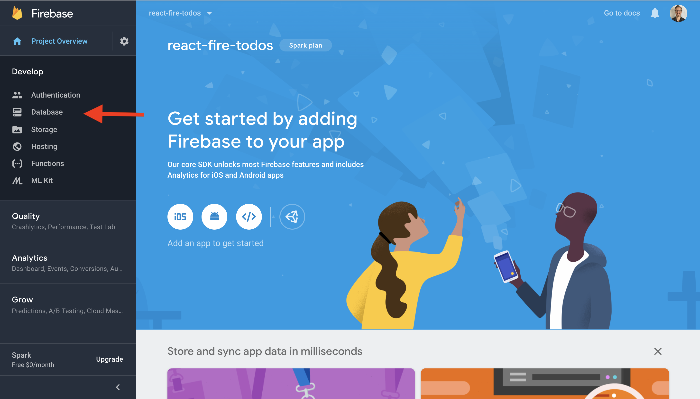
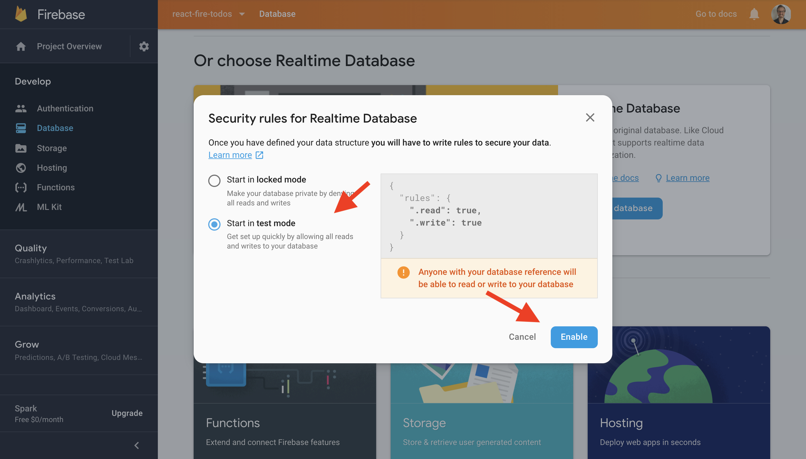
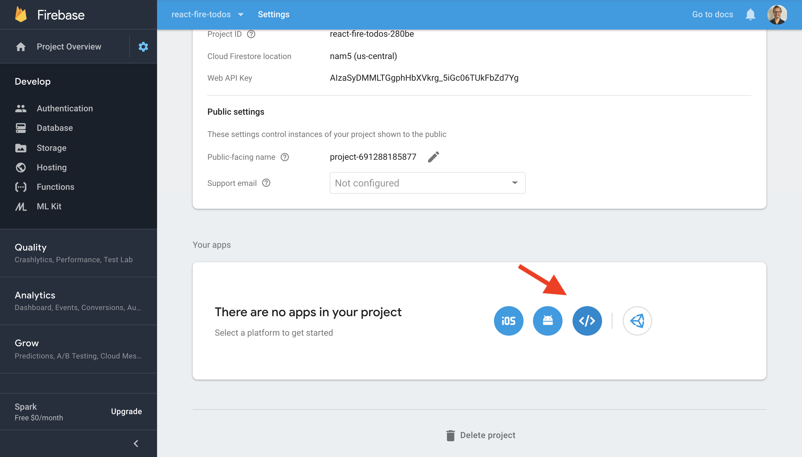
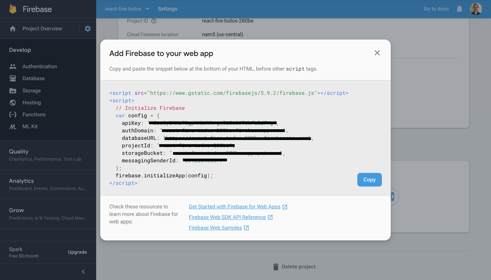

#  The FRN Stack

For this lesson, we'll look at a secretly popular tech stack known at the FRN stack (Firebase, ReactJS, and NodeJS). 

Here are the high level points we'll cover in this lesson:

- Pre-requisites and requirements
- What is Google Firebase?
- Set up Google Firebase
- Light overview of React/Setup for lesson
- Build a Todos App
- Conclusion

Here are the learning objectives:

_By the end of this lesson, students should be able to:_

- Setup a Google Firebase Project
- Use the Google Firebase Real Time Database (RTDB) and Authentication
- Reference Google Firebase documentation
- Demonstrate preliminary understanding of Google Firebase and how to use it with React

## Pre-requisites and Requirements

_To have success in this lesson, students should have:_

- Familiarity with ReactJS Fundamentals..i.e. `components`, `props`, `component state`, `stateless functional components vs class based components`, and `component lifecycle methods`.
- latest version `nodejs` installed
- `create-react-app` build tool installed
- `VS Code`as their text editor!
- A Chrome Browser

_Please see below for links to the resources referenced above_

## What is Google Firebase?

_Founded by James Tamplin and Andrew Lee as “Firebase” in 2011, then acquired by Google in 2014._

_“Firebase frees developers, so they can focus on creating phenomenal user experiences. You don’t need to manage servers, write an API, or configure a datastore.”_

_“Firebase is your server, your API and your datastore."_

#### Who Uses Google Firebase?

Ever since Google acquired firebase in 2014, it's rise in popularity has skyrocked to where it is today. Google Firebase gets better each year with robust features for both web and mobile applications.

Many developers and companies have found tremendous value in this technology, which is why you probably recognize all of these brands!

#### Not Just A Database

This is where many people get confused when they hear of Google Firebase for the first time. Although the Real Time Database is a core feature, it's just one of several services you can use from Google Firebase:

**The Best Definition of Google Firebase is that it's a "BAAS" (Backend As A Service)**

#### The Google Firebase Real Time Database (RTDB)
- The Core Service That Put the Spotlight on Firebase
- A Single JSON Object that allows up to 32 levels of Depth (We don't recommend nesting your data that deep though)

## Setup Google Firebase

It's the moment we've all been waiting for! It's time to set up Google Firebase!

**The First Step to Get Started is to "Signup For Google Firebase"**

- Go to: [https://firebase.google.com/](https://firebase.google.com/)

#### Step One - "Sign In":

#### Step Two - "Go to Console" or :"Get Started":

#### Step Three - "Add Project":

#### Step Four - "Project Details - Name Your Project: React-Fire-Todos":

#### Step Five - "Create Project and Continue":

#### Step Six - "Begin Setup of RTDB"

#### Step Seven - "Setup RTDB Continued"

#### Step Eight - "Setup RTDB Continued"

#### Step Nine - "How to Add Firebase to React"

#### Step Ten - "How to Add Firebase to React (continued)"

#### Step Eleven - "How to Add Firebase to React (continued)"

## Setup Our React Frontend

It's time to make sparks fly! Assuming you have the `create-react-app` build tool installed. Navigate to your Desktop `cd ~/Desktop` and then run `create-react-app react-fire-todos` to build our react application and install base dependencies.

